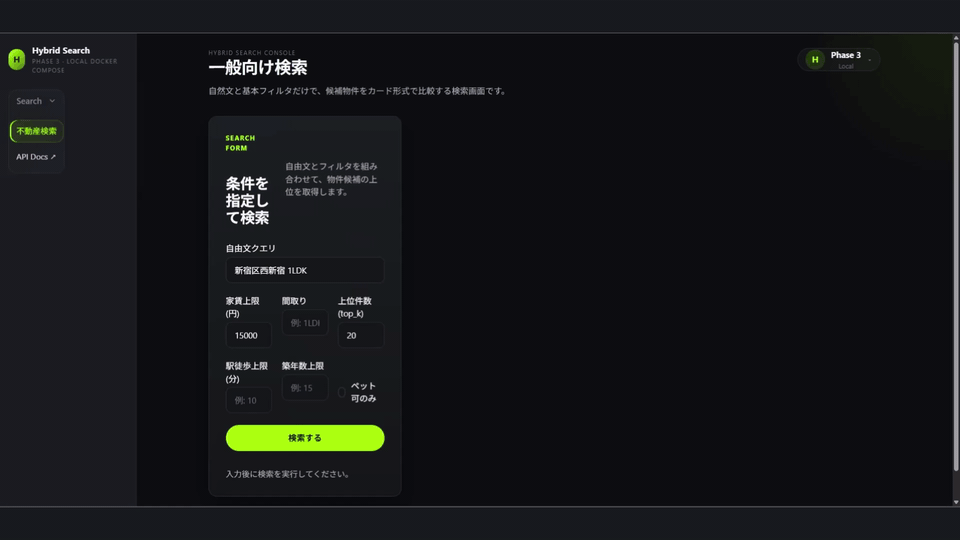
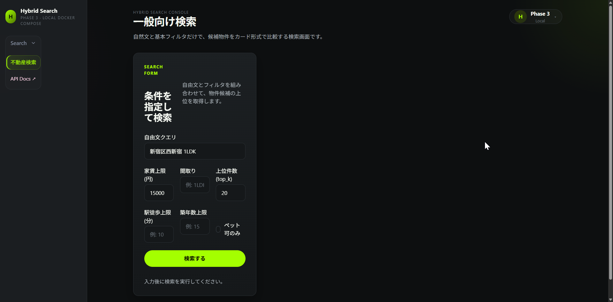
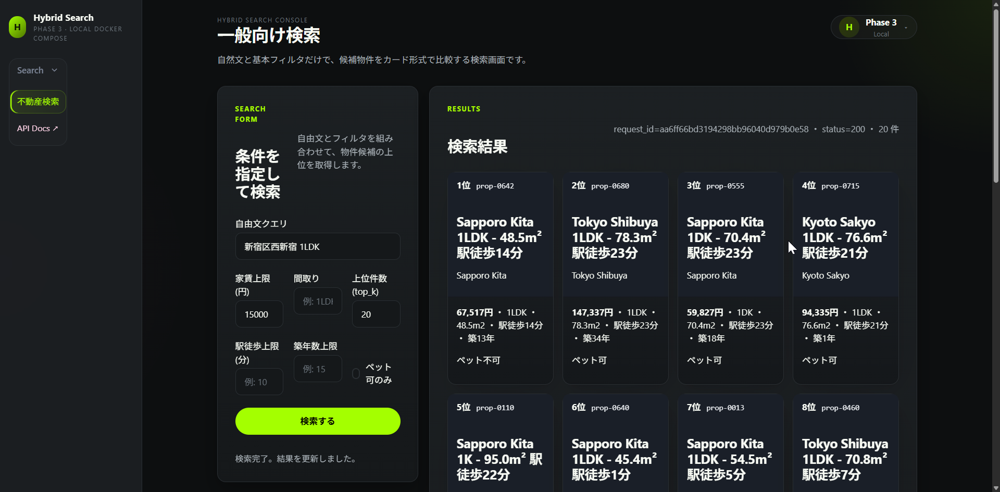

# study-hybrid-search-local

Phase 3 は、不動産ハイブリッド検索を **ローカル完結で学ぶ** フェーズ。

中核構成:

- `Meilisearch`
- `multilingual-e5`
- `Redis`
- `LightGBM LambdaRank`
- `PostgreSQL`

`Meilisearch` は `Elasticsearch` より導入しやすく、学習用ローカル構成として扱いやすいため採用する。

## 動作イメージ

`make build && make up && make seed && make train && make serve-bg && make wait-api` の後、
ブラウザで http://localhost:8000/ にアクセス (自動で `/ui/` に redirect)。

### 検索前 / 検索後

| 検索前 (空の状態) | 検索後 (3 段融合 + LightGBM rerank 結果) |
|---|---|
|  |  |

検索結果の各カードには `lexical_rank` (Meilisearch BM25) / `semantic_rank` (pgvector ANN) /
`final_rank` (LightGBM LambdaRank) が all non-zero で表示される — 3 系統が動いている証拠。
`/feedback` (click / favorite / inquiry) を経由すれば再学習用の `feedback_events` に永続化される。

## Phase 3 の主役

| 技術 | 役割 |
|---|---|
| Meilisearch | lexical 検索 |
| multilingual-e5 | semantic 類似度 |
| Redis | キャッシュ |
| LightGBM LambdaRank | 再ランキング |
| PostgreSQL | データ永続化 |
| Docker Compose | ローカル実行基盤 |

## この Phase でやらないこと

- Cloud Run / BigQuery / GCS / Pub/Sub
- Terraform / WIF / Secret Manager
- Vertex AI Pipelines / Endpoints / Model Registry / Monitoring
- BQML / Dataflow / RAG / Explainable AI / SLO / GKE / KServe

## ドキュメント

- [docs/tasks/02_移行ロードマップ.md](docs/tasks/02_移行ロードマップ.md): Phase 3 の決定的仕様
- [docs/architecture/01_仕様と設計.md](docs/architecture/01_仕様と設計.md): 実装配置
- [docs/architecture/03_実装カタログ.md](docs/architecture/03_実装カタログ.md): 実装棚卸し
- [docs/runbook/05_運用.md](docs/runbook/05_運用.md): 運用手順
- [docs/runbook/04_検証.md](docs/runbook/04_検証.md): app / ML の OK 判定
- [CLAUDE.md](CLAUDE.md): 作業ガイド

## 検証コマンド

- `make verify-app`: `/health` `/readyz` `/search` `/feedback` `/ui/` `/ui/dev/model/metrics` `/ui/dev/data`
- `make verify-ml`: `label` → `build-training-dataset` → `train` → `evaluate` と ML artifact 確認
- `make verify-all`: 静的検証 + Docker Compose + app + ML をまとめて実行
