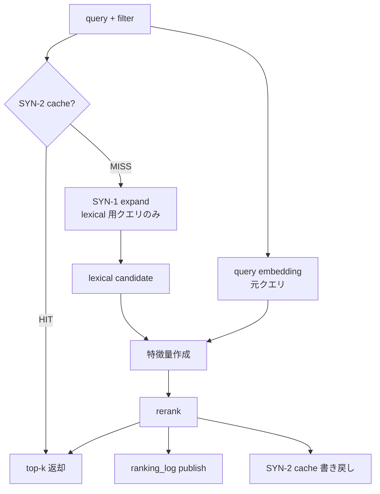
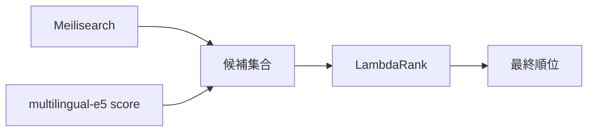
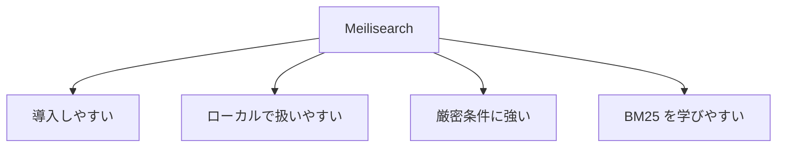
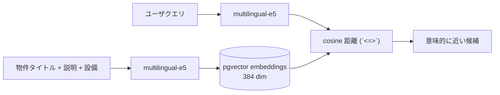
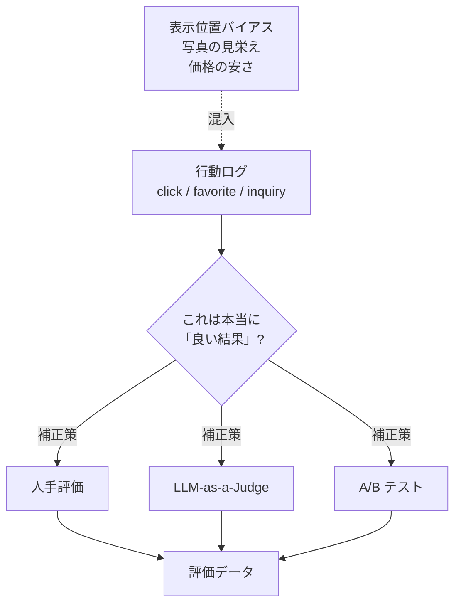

# 図解（Phase 3）

Phase 3 の教育資料で使う図解原稿。  
ハイブリッド検索の 3 段構成が伝わるものだけを残す。

---

## 図 1: 全体アーキテクチャ (Redis は 2 役割)

```mermaid
flowchart LR
    U[ユーザー] --> API[/search]
    API --> SC{SYN-2<br/>cache lookup}
    SC -->|HIT| Resp[検索結果]
    SC -->|MISS| SE[SYN-1<br/>同義語展開]
    SE --> Meili[Meilisearch BM25]
    API --> E5[multilingual-e5]
    Meili --> RRF[RRF 融合]
    E5 --> PG[(pgvector)]
    PG --> RRF
    RRF --> Rank[LightGBM LambdaRank]
    Rank --> Pub[ranking_log publish]
    Rank --> SCw[SYN-2 cache 書き戻し]
    Rank --> Resp
    Redis[(Redis)] -. syn:* .- SE
    Redis -. search:* .- SC
    Redis -. search:* .- SCw
```

> Redis は **同じ container** に同居するが key prefix が分離: `syn:*` (SYN-1 同義語辞書) / `search:*` (SYN-2 レスポンスキャッシュ)。

---

## 図 2: 処理の流れ (cache 短絡 + 同義語展開を含む)



---

## 図 3: 候補取得と再ランキングの分担



---

## 図 4: Meilisearch を使う理由



---

## 図 5: 回帰 vs ランキング (Phase 1 と Phase 3 の違い)

```mermaid
flowchart LR
    subgraph Phase1["Phase 1 — 住宅価格予測 (回帰)"]
      P1in[特徴量<br/>緯度・部屋数・築年] --> P1m[XGBoost / LightGBM]
      P1m --> P1out[価格 (数値)]
      P1out --> P1eval[RMSE / MAE]
    end
    subgraph Phase3["Phase 3 — 検索 (ランキング)"]
      P3in[クエリ + 候補集合] --> P3m[LightGBM LambdaRank]
      P3m --> P3out[順位付き Top-K]
      P3out --> P3eval[NDCG / MAP / Recall@K]
    end
```

> 同じ LightGBM でも、目的関数 (二乗誤差 vs LambdaRank) と評価指標が別物。

---

## 図 6: ベクトル検索のデータフロー



> 物件側ベクトルは `make seed` で事前投入、クエリ側は毎回オンデマンド。

---

## 図 7: Redis の 2 役割 — SYN-1 同義語辞書 / SYN-2 レスポンスキャッシュ

```mermaid
flowchart LR
    subgraph SYN1["SYN-1: ranking 精度改善"]
      U1[クエリ<br/>駅近 1K] --> EXP[RedisSynonymExpander]
      EXP -->|SMEMBERS syn:駅近<br/>SMEMBERS syn:1K| RDS1[(Redis<br/>syn:*)]
      RDS1 --> EXP
      EXP -->|"駅近 駅徒歩 1K ワンルーム ..."| BM25[Meilisearch BM25]
    end
    subgraph SYN2["SYN-2: UX/latency 改善"]
      U2[/search 入口] --> CACHE[RedisSearchCache]
      CACHE -->|"GET search:v1:..."| RDS2[(Redis<br/>search:*)]
      RDS2 -->|HIT| Skip[encoder/retriever/<br/>reranker/publisher<br/>全 skip]
      RDS2 -->|MISS| Pipe[フル pipeline]
      Pipe -->|"SETEX TTL=60s"| RDS2
    end
```

> 同じ Redis container に同居するが、key prefix が `syn:` / `search:` で完全に分離。両者は別 Port (`SynonymExpanderPort` / `SearchCachePort`) として独立。SYN-2 が HIT すると SYN-1 も lexical 段ごと skip される (cache 短絡が先)。

---

## 図 8: 評価データの難しさ



> 行動ログだけでは「真の良さ」は測れない。複数チャネルで補正するのが実案件の作法。
