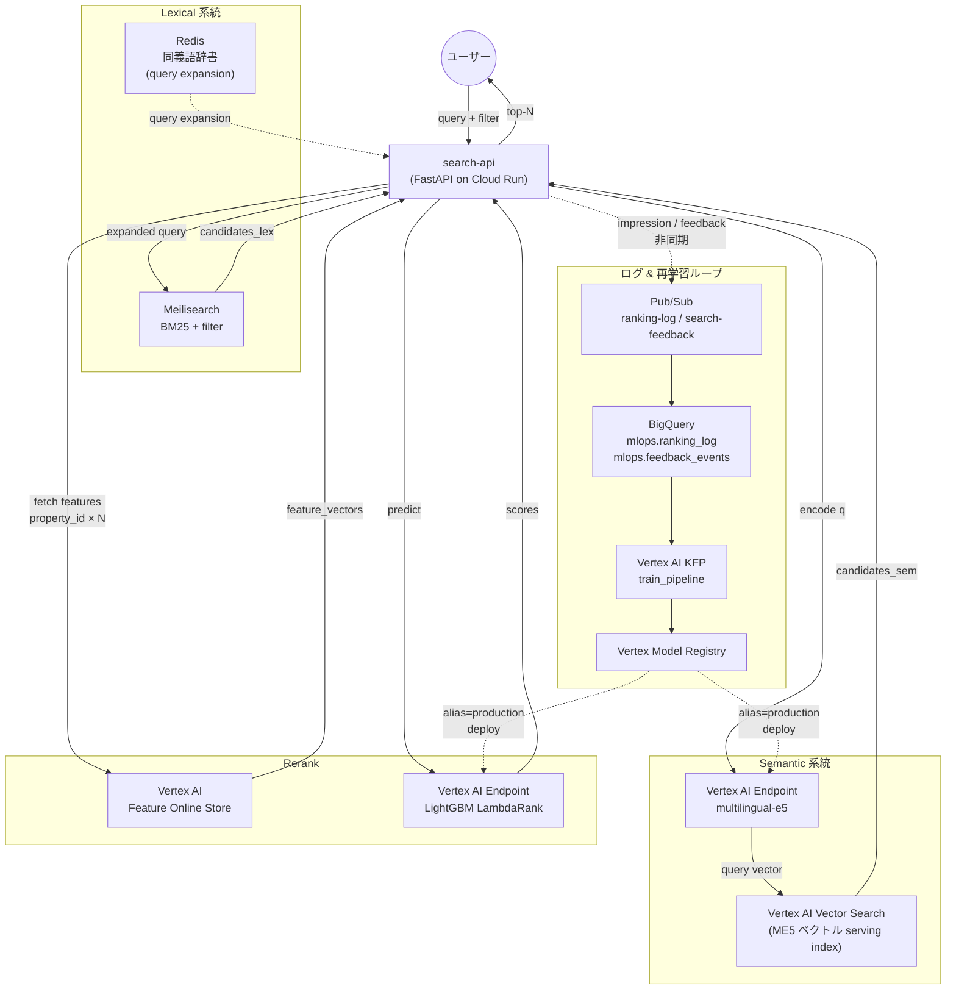
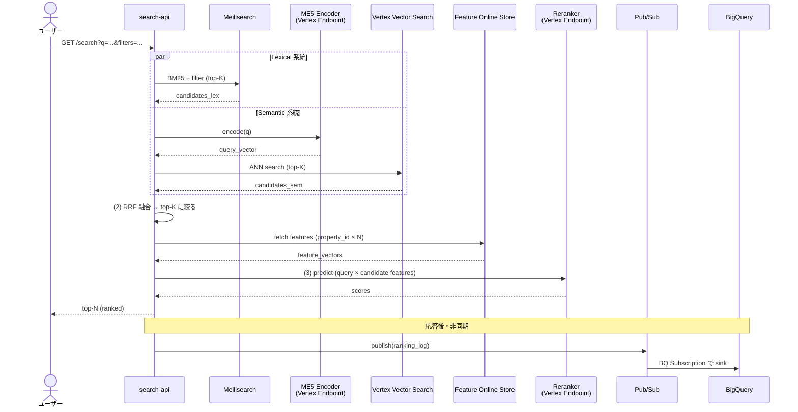
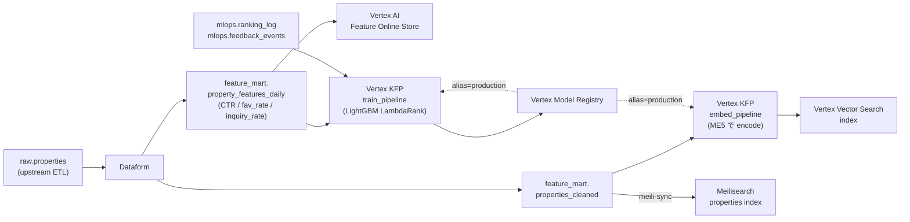
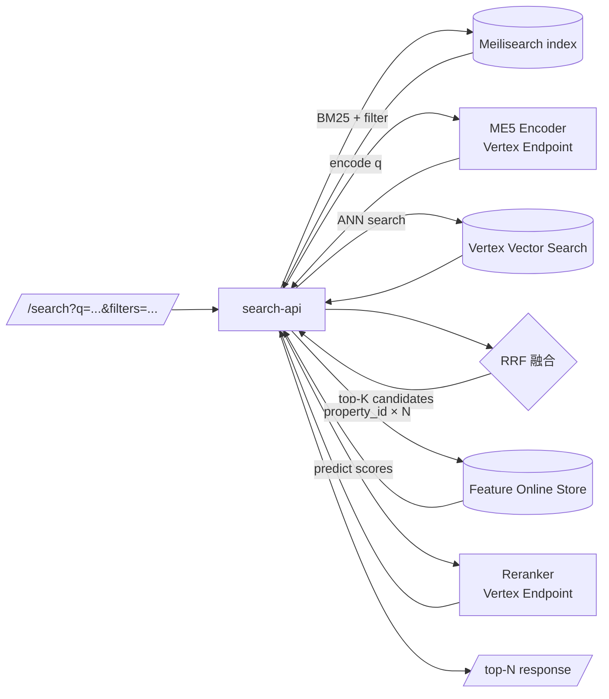

# 01_仕様と設計

> 本ドキュメントは Phase 7 の仕様と設計、**および Phase 7 が canonical 起点 / 教材コード完成版であることに伴い、ハイブリッド検索 Phase 横断仕様 (§1) と Cloud Composer の位置づけ (§6) の canonical** を持つ。権威順位は `02_移行ロードマップ.md > 01 > README.md`。親リポ [`docs/architecture/01_仕様と設計.md`](../../../../docs/architecture/01_仕様と設計.md) は本ファイルを参照する薄いナビゲーションハブ (重複設定回避)。
>
> **2026-05-03 教育コード化方針の改訂**: コード化対象を **Phase 1 / 2 / 3 / 4 / 7** に限定。Phase 5 / 6 は **論理 Phase** (個別コード保守なし、Phase 7 完成版コードを参照する資料中心の Phase)。Phase 4 は **Phase 7 完成版からの引き算ではなく Phase 3 からの足し算** で独立コード化。詳細は親 [`README.md` §4 コード化方針](../../../../README.md)。
>
> **2026-05-05 改訂**: 本ファイルは **統一フォーマット 12 章** に従う。各章は親 docs/01 / Phase 3 docs/01 と共通の見出しを持ち、Phase 7 固有内容を埋める。該当なしの章は「該当なし — XXX 参照」と明記しつつ見出しは保持する。

Phase 7 は **教材コード完成版 / canonical 起点 / 到達ゴール** であり、**Phase 5 / 6 の技術要素 (Vertex AI Pipelines / Feature Store / Vertex Vector Search / Model Registry / Cloud Composer 本線 orchestration / PMLE 4 技術) を本 phase 配下に集約し**、Serving 層は Vertex AI Endpoint から GKE + KServe InferenceService に差し替える。Phase 7 固有として **KServe pod から Feature Online Store を Feature View 経由で opt-in 参照する経路** を追加。

---

## 文書構成

この文書は情報量が多いため、**「何を知りたいか」で読む章を切り替える**前提で構成する。最初から通読するより、次の表を索引として使う。

| 章 | 役割 | まず読む人 |
|---|---|---|
| §0 | この phase で絶対に崩さない原則 | 全員 |
| §1 | 前提条件と、この文書の守備範囲 | 初見の読者 |
| §2 | **Phase 3-7 共通**のハイブリッド検索 canonical | 検索アプリ全体像を掴みたい人 |
| §3 | **Phase 6-7 共通**の orchestration canonical | Composer / Vertex Pipelines の責務を確認したい人 |
| §4 | **Phase 7 固有**の serving 差分 | GKE / KServe 追加差分だけ追いたい人 |
| §5 | Phase 6 から継承する PMLE 技術 | 「どこまで据え置きか」を確認したい人 |
| §6 | Port / Adapter / DI / `make check` の実装規約 | コードを直す人 |
| §7 | 現在の実装状態と未検証領域 | 作業前に現在地を知りたい人 |
| §8 | 推奨の読み順 | 学習者 / レビュア |

---

## §0. 位置付け / 文書構成 — 不変は「ハイブリッド検索というテーマと中核コード」のみ

詳細仕様は `docs/tasks/TASKS_ROADMAP.md §0`。要約:

- **不変**: 題材 (不動産ハイブリッド検索) と中核コード (Meilisearch BM25 + **Vertex Vector Search** + ME5 + RRF + LightGBM LambdaRank の挙動 / `/search` デフォルト応答)
- **Phase 7 = canonical 起点 / 教材コード完成版 / 継続改善 MLOps サイクル**: Phase 5 / 6 の技術要素を本 phase 配下に集約し本実装する到達ゴール。**Phase 4 の検索ログ正解データパイプラインを Cloud Composer / Vertex Pipelines / Feature Store / Vector Search / Model Registry / GKE / KServe に接続し、ログ収集 → ラベル作成 → 特徴量更新 → ベクトル index 更新 → reranker 再学習 → 評価 → deployment gate → KServe 反映 までを継続改善サイクルとして本 phase 配下に集約** (v3 設計改訂、2026-05-05、詳細は親 [`docs/将来展開-v3.md`](../../../../docs/将来展開-v3.md))
- **Phase 5 / 6 との関係 (2026-05-03 改訂)**: Phase 5 / 6 は **論理 Phase** (個別コード保守なし、本 Phase 7 完成版コードを参照する資料中心の Phase)。本 Phase の本実装が Phase 5 / 6 の技術習得主眼の参照先となる
- **Phase 4 との関係 (2026-05-03 改訂 + v3 設計改訂)**: Phase 4 は **本 Phase からの引き算ではなく Phase 3 からの足し算で独立コード化** (GCP MLOps 土台 + 検索ログ正解データパイプライン、Vertex AI 以降は含めない)。本 Phase は Phase 4 の検索ログ正解データパイプライン (`raw_events` / `curated` / `ranking_labels` / `training_dataset` / `evaluation_metrics`) を Composer DAG 駆動の本線継続改善サイクルに接続する
- **本 Phase で本実装する技術**: PMLE 統合技術 (BQML / Dataflow Flex Template / TreeSHAP Explainability / Monitoring SLO + burn-rate alert / Composer-managed BigQuery monitoring query) / Vertex AI Pipelines / **Vertex Vector Search** / **Vertex AI Feature Store** / **Cloud Composer 3 本 DAG** (`daily_feature_refresh` / `retrain_orchestration` / `monitoring_validation`) / Vertex Model Registry / BigQuery / Meilisearch + GKE Deployment + KServe InferenceService。Phase 7 固有: KServe → Feature Online Store を **Feature View 経由で** opt-in 参照
- **Composer の上下関係 + 二重化禁止**: Composer = 上位 orchestrator、Vertex Pipelines = 下位 ML executor。`train/evaluate/register` を Composer 側に書かない (カニバリ禁止)。Cloud Scheduler / Eventarc / Cloud Function / Vertex `PipelineJobSchedule` の再導入禁止 — 詳細は §3
- **教材対象外**: 親 [`README.md` §1](../../../../README.md) のリストに従う (Vertex Vector Search は 2026-05-01 改定で外し、本番 serving index として採用)
- **自由**: 新 adapter / manifest / Terraform モジュール (`gke` / `kserve`) / HPA / NetworkPolicy / SA 紐付け等

### 0.1 ⛔ ゴール劣化禁止 (= クライアント罰金回避ライン)

本仕様書で「**本線**」「**必須**」「**canonical**」「**不変**」と書かれた要件 (中核 5 要素 / Composer = 上位 orchestrator / 本線 retrain DAG / Feature View 経由 fetch / etc.) を **未達のまま「完了」「OK」「W2-X 完了とみなす」と扱うのは禁止**。違反するとクライアント契約見送り罰金レベル。

**禁止する hedging 表現** (任意のドキュメント / commit message / PR description):
- 「深追いは別 sprint (候補)」
- 「現状で W2-X 完了とみなし、次のステージへ進む」
- 「Stage X.Y 未解決のまま完了扱い」
- canonical 必須項目に対する「task SUCCEEDED は別 sprint」「live verify は別 session」「明日以降」「後追い」
- 判断 A/B が並列に書かれている場合、勝手に A を選んで B を「別 sprint」へ送る (User 明示確認なし)

**正しい扱い方**:
1. canonical 未達は ⚠️ マーカー付きで「**canonical 未達 (= ゴール劣化)、追加 sprint 必須**」と明示
2. canonical 必須項目と機能影響低の項目を **明確に区別**してダッシュボード/roadmap に書く
3. canonical 違反が生じる選択肢は ~~取り消し線~~ で不採用宣言する
4. 「W2-X 完了」を書く前に、本仕様書 §0 の不変条件 + §3 (Composer canonical) + §6 (Port/Adapter 境界) と **必ず照合**

**過去 incident** (2026-05-03): Phase 7 Composer DAG `retrain_orchestration::check_retrain` が SUCCEEDED 未達なのに、過去 session の Claude が `TASKS_ROADMAP.md §4.1` で「A: 現状で W2-4 完了とみなす / B: SUCCEEDED まで深追い」のうち **A を勝手に採用** し、ダッシュボード V5 を「別 sprint 候補」扱いしていた。本仕様書 §3 と親 CLAUDE.md は「**本線 retrain schedule は Composer DAG**」と明記しているため、SUCCEEDED 未達 = canonical の根幹未実証 = ゴール劣化。User 指摘:「やはり人工知能が悪さしてゴールを劣化させてた、クライアントから罰金レベル」。本 incident を踏まえ §4.1 は B 採用 + A 取り消し線で書き直し済。

---

### §0.1 共通前提

この章は「この文書が何を規定し、何を規定しないか」の境界を揃えるための前提を置く。実装の詳細に先に入る前に、Phase 7 が単独の新規設計ではなく **Phase 5-6 の継承 + serving 差分** であることを確認する。

- **目的**: Phase 6 統合コードを崩さずに serving 層を Kubernetes ネイティブ (GKE + KServe) に置き換え、宣言的 manifest / HPA / NetworkPolicy / Workload Identity を動くコードで触る
- **前提知識**: Phase 5 + Phase 6 既習扱い (継承内容詳細は §0 / §3 / §5、教育設計上の段差は親 [`README.md` §2 Phase 一覧](../../../../README.md))
- **reference architecture**: Phase 5 [`docs/01_仕様と設計.md`](../../../../5/study-hybrid-search-vertex/docs/01_仕様と設計.md) を継承 (詳細は §2.7)
- **環境**: WSL + `uv` + `kubectl` + `gke-gcloud-auth-plugin` + Terraform 1.9+ / GCP project `mlops-dev-a` / region `asia-northeast1` / `make check` で CI 同等 PASS

---

## §1. ハイブリッド検索の仕様と設計 (Phase 3-7 共通)

> 本セクションは **Phase 3 以降の Phase 横断仕様 の canonical**。親 [`docs/01_仕様と設計.md` §1](../../../../docs/architecture/01_仕様と設計.md) はここを参照するナビゲーションハブ。

Phase 3 以降の題材は **不動産ハイブリッド検索** で固定。本セクションは Phase 横断で不変な仕様・設計と、Phase ごとに差し替わる adapter を 1 つの表で見渡すための正本。

### 2.1 題材と機能仕様

- **ドメイン**: 不動産検索
- **ユースケース**: 自由文クエリ + 構造化フィルタ (`city` / `price_lte` / `walk_min` など) → 物件ランキング上位 N 件

| 項目 | 値 |
|---|---|
| エンドポイント | `GET /search` (中核挙動)、`POST /feedback` (行動ログ受付) |
| 入力 | 自由文クエリ + フィルタ + `limit` |
| 出力 | property ID + score + ハイライト + ranking 上位 20 件 |
| ranking ログ | **Event schema 共通契約** (Phase 3 PostgreSQL ↔ Phase 4 BigQuery ↔ Phase 7 Composer DAG で同型、v3 設計改訂): `search_events` (`event_id` / `search_id` / `user_id` / `session_id` / `query` / `filters_json` / `timestamp` / `app_version` / `model_version`) / `search_impressions` (`event_id` / `search_id` / `property_id` / `rank` / `lexical_score` / `vector_score` / `rrf_score` / `rerank_score` / `timestamp`) / `user_actions` (`event_id` / `search_id` / `property_id` / `action_type` / `action_value` / `timestamp`)。`action_type` enum 8 種は **アプリ emit 5 種 (`click` / `detail_view` / `favorite` / `request_button_click` / `request_complete`) + synthetic 注入専用 3 種 (`inquiry_complete` / `contract` / `bounce`) に分かれる** (2026-05-05 補追、Phase 3 [`docs/02_移行ロードマップ.md`](../../../../3/study-hybrid-search-local/docs/02_移行ロードマップ.md) §2.1 / §4.7 で確定)。`user_actions` テーブルへの INSERT は 5 種のみ、3 種は `ranking_labels.label_source='synthetic_*'` でのみ登場 |
| 再学習ループ | 重み付き relevance label (`click`=1, `detail_view`=2, `favorite`=3, `request_button_click`=4, `request_complete`=5, `inquiry_complete`=7, `contract`=10, `no_action`=0, `bounce`=0/-1) を BigQuery `ranking_labels` に作成し、LightGBM LambdaRank 用 `training_dataset` を整備して Composer DAG `retrain_orchestration` が Vertex AI Pipelines retrain → Vertex Model Registry promote 判定 → KServe 反映を駆動 |

### 2.2 設計 (3 段構成)

クエリ受領 → 2 系統で候補取得 (並列) → RRF 融合 → LightGBM 再ランク → 返却。下の図はすべて Phase 5 (Vertex AI 標準 MLOps) の構成を基準にしている。**Phase 7 では `Vertex AI Endpoint` を `KServe InferenceService` に、`Cloud Run` を `GKE Deployment` に読み替える** (Phase 7 固有の serving 差分は §4)。同 §2 の図は Phase 5 / 6 の論理 Phase 説明と Phase 7 の本実装の両方の参照点として共通使用するため、Phase 5 基準で描いている。

#### 2.2.1 関係図 (コンポーネント間の依存)



#### 2.2.2 シーケンス図 (`/search` の 1 リクエストの流れ)



#### 2.2.3 段表

| 段 | 役割 | アルゴリズム / 技術 |
|---|---|---|
| (1a) Lexical | キーワード一致 + 構造化フィルタによる候補抽出 | BM25 (Meilisearch / Elasticsearch 等) |
| (1b) Semantic | 意味類似による候補抽出 | multilingual-e5 で encode → ベクトルストアで ANN |
| (2) 融合 | 異種 score の順位を統合し top-K に絞る | Reciprocal Rank Fusion (RRF) |
| (3) Rerank | 学習済モデルで最終ランキング | LightGBM LambdaRank (NDCG@K で評価) |

### 2.3 不変ルール (Phase 3-7 共通)

- **中核 5 要素の挙動・データフロー・デフォルト `/search` 応答は維持**: Meilisearch BM25 / multilingual-e5 / ベクトルストア (Phase 4 = BigQuery `VECTOR_SEARCH` / Phase 5+ = Vertex AI Vector Search) / RRF / LightGBM LambdaRank
- **置換・削減・無効化は事前の明示合意を必須** (過去に AI が中核を勝手に書き換えた事故あり)
- **Port/Adapter 境界**: lexical retriever / semantic encoder / semantic vector store / reranker / feature fetcher / ranking log の 6 軸はすべて Port 経由で抽象化し、adapter だけ差し替える

### 2.4 Phase 別の実装段差 (中核は不変、adapter だけ差し替え)

| 段 / 関心事 | Phase 3 (Local) | Phase 4 (GCP) | Phase 5-7 (Vertex AI) | 実案件 reference |
|---|---|---|---|---|
| (1a) Lexical | Meilisearch (Docker) | Meilisearch on Cloud Run | Meilisearch on Cloud Run (据え置き) | **Elasticsearch** |
| Lexical 補助 | **Redis 同義語辞書** (query expansion) | **Redis 同義語辞書** (query expansion) | **Redis 同義語辞書** (query expansion) | **Redis 同義語辞書** (「マンション」→「アパート / 共同住宅」のような query expansion 辞書) |
| (1b) Semantic encoder | multilingual-e5 (local) | multilingual-e5 (Cloud Run) | multilingual-e5 (Vertex AI Endpoint / KServe) | 同一 |
| (1b) Semantic vector store (serving index) | pgvector / 簡易 ANN | **BigQuery `VECTOR_SEARCH`** | **Vertex AI Vector Search** (ME5 ベクトル serving index、source は BigQuery 側 embedding テーブル) | 同一 |
| (2) 融合 | RRF | RRF | RRF | 同一 |
| (3) Rerank | LightGBM LambdaRank (in-process) | LightGBM LambdaRank (Cloud Run) | LightGBM LambdaRank (Vertex AI Endpoint / KServe) | 同一 |
| 特徴量管理 | local files | BigQuery feature table / view | **Vertex AI Feature Store (Feature Group / Feature View / Feature Online Store)** (必須、training-serving skew 防止) | 同一 |
| ranking log | local SQLite / Postgres | BigQuery `mlops.ranking_log` (Pub/Sub → BQ Subscription) | 同上 | 同一 |
| 再学習トリガ | 手動 | Cloud Scheduler + Cloud Function (Phase 4-5 継続、Phase 5 では本線も同経路) | **Cloud Composer DAG** (Phase 6 起点 — §3) | 同一 |
| モデル管理 | local artifact | GCS | Vertex Model Registry (昇格運用) | 同一 |
| 監視 | 手動 | Cloud Monitoring | Cloud Monitoring + Vertex Model Monitoring | 同一 |

**「中核」(Meilisearch / multilingual-e5 / RRF / LightGBM LambdaRank)** は Phase 3-7 共通で不変。それ以外は adapter 実装を差し替える設計。

### 2.5 データフロー図 (Phase 5 を例に)

この小節は「検索アプリのオンライン経路」と「オフライン再学習経路」を図で固定する。Phase 7 でもここで示す主データフロー自体は崩さず、差し替えるのは serving adapter のみ。

#### 2.5.1 オフライン: 特徴量・埋め込み・モデルの生成



#### 2.5.2 オンライン: `/search` のオーケストレーション



#### 2.5.3 ログ → 再学習ループ (Event schema 共通契約 + 継続改善サイクル)

Event schema 共通契約 (`search_events` / `search_impressions` / `user_actions` の 3 テーブル + `action_type` enum 8 種、Phase 3 PostgreSQL ↔ Phase 4 BigQuery ↔ Phase 7 Composer DAG で同型) を Phase 7 の Composer DAG が orchestration の本線として駆動する継続改善サイクル:

```mermaid
flowchart LR
    SAPI["search-api<br/>(GKE)"]
    PS1["Pub/Sub<br/>search-events / search-impressions"]
    PS2["Pub/Sub<br/>user-actions"]
    BQ_EV[("BigQuery<br/>mlops.search_events")]
    BQ_IMP[("BigQuery<br/>mlops.search_impressions")]
    BQ_ACT[("BigQuery<br/>mlops.user_actions")]
    BQ_LBL[("BigQuery<br/>mlops.ranking_labels<br/>(重み付き relevance)")]
    BQ_DS[("GCS<br/>training_dataset")]
    BQ_MET[("BigQuery<br/>mlops.evaluation_metrics<br/>NDCG@10 / Recall@K /<br/>CTR / CVR")]
    Sched["Cloud Composer<br/>(retrain_orchestration DAG)"]
    Mon_DAG["Cloud Composer<br/>(monitoring_validation DAG)"]
    TP["Vertex KFP<br/>train_pipeline"]
    MR["Vertex Model Registry<br/>(deployment gate)"]
    KServe["KServe<br/>InferenceService"]
    Mon["Vertex AI<br/>Model Monitoring"]

    SAPI -.->|search_events / impressions| PS1 --> BQ_EV
    PS1 --> BQ_IMP
    SAPI -.->|user_actions (emit 5 種)<br/>click / detail_view / favorite /<br/>request_button_click / request_complete| PS2 --> BQ_ACT
    SyntheticYAML["definitions/labeling/<br/>synthetic_actions.yaml<br/>(inquiry_complete /<br/>contract / bounce /<br/>long_stay)"]
    Sched -->|labeling SQL| BQ_LBL
    BQ_EV --> BQ_LBL
    BQ_IMP --> BQ_LBL
    BQ_ACT --> BQ_LBL
    BQ_LBL --> BQ_DS
    Sched -->|定期 trigger| TP
    BQ_DS --> TP
    TP --> MR
    MR -->|deployment gate 合格| KServe
    KServe -.->|drift / skew| Mon_DAG --> BQ_MET
    BQ_MET --> Mon_DAG
    Mon_DAG -.->|alert| Mon
```

### 2.6 ローカルアプリで確認できること / GCP 実機でしか確認できないこと

Phase 7 では `search-api` の import / boot / DI / API contract のかなりの部分をローカルで確認できる一方、**ハイブリッド検索の canonical 本線そのもの**は GCP 上の managed service と cluster に依存する。つまり、ローカルは「壊れていないことを早く落とす場所」、GCP は「本当に正しい経路で動いていることを証明する場所」と役割が分かれる。

| 観点 | ローカルアプリで確認可能 | GCP 実機でのみ確認可能 | 判定の意味 |
|---|---|---|---|
| FastAPI boot / import | ✅ `app.main` import、container 起動、`/livez` 200 | — | アプリが最低限起動する |
| DI / wiring | ✅ fake / mock で `SearchBuilder`、`SearchService`、Port 配線 | — | adapter 選択や依存注入が壊れていない |
| API contract | ✅ `/search` / `/feedback` の schema、handler 単体 test | — | HTTP 契約が壊れていない |
| Lexical 単体 | △ Meilisearch を別途立てれば局所確認可 | ✅ Cloud Run 上の実 index / 実データでの確認 | canonical では実 index 同期済みである必要がある |
| Semantic encoder 単体 | △ mock / fake で encode 呼び出し境界までは確認可 | ✅ KServe / 実 model alias / 実埋め込み生成 | 本当に query vector が生成されるか |
| Vertex Vector Search | ❌ local fake で interface しか見えない | ✅ endpoint / deployed index / `find_neighbors` | semantic 候補が実際に返るか |
| Feature Online Store / Feature View | ❌ local fake で merge ロジックしか見えない | ✅ Feature View endpoint / online fetch | rerank 入力 feature が serving 側で取得できるか |
| RRF 融合ロジック | ✅ pure Python 単体 test 可能 | — | lexical / semantic の順位統合自体はローカルで保証できる |
| Reranker 呼び出し境界 | ✅ fake / mock で request 生成まで確認可 | ✅ KServe `production` alias / 実推論応答 | rerank score が本当に返るか |
| 3 系統 all non-zero | ❌ | ✅ `lexical` / `semantic` / `rerank` の同時寄与 | ハイブリッド検索として片肺飛行していない証拠 |
| canonical 経路 | ❌ | ✅ Meilisearch + VVS + FOS + KServe の 1 経路 | 最新仕様どおりの本線で動作している証拠 |
| legacy residue 不在 | ✅ `rg` による静的検査 | ✅ manifest / config / terraform output も含む最終確認 | 教育コードとして残骸を残していない証拠 |
| ranking log / feedback sink | △ publish call の単体確認まで | ✅ Pub/Sub → BigQuery 着地 | 再学習ループが運用可能か |
| retrain / deploy ループ | ❌ | ✅ Composer / Vertex Pipelines / Model Registry | MLOps 全体の閉ループが成立しているか |

**実務上の読み替え**:

- ローカルで `OK` でも、それは **「壊れていない」** の証明に留まる
- GCP で `G3-G5` が `OK` になって初めて、**「Phase 7 の canonical ハイブリッド検索として成立している」** と言える
- したがって、ローカル確認だけで「ハイブリッド検索が動いた」と表現しない。正確には **「ローカルでは API / wiring / pure logic を確認できる。実ハイブリッド検索の成立確認は GCP 実機が必要」**

### 2.7 実案件 reference architecture

「実案件で Vertex AI 標準 MLOps を本番運用するときの理想構成」は Phase 5 [`docs/01_仕様と設計.md` §「実案件想定の reference architecture」](../../../../5/study-hybrid-search-vertex/docs/01_仕様と設計.md) を正本とする。

要約: **Elasticsearch + Redis 同義語辞書 + multilingual-e5 + Vertex AI Vector Search + RRF + LightGBM LambdaRank**。本リポは Meilisearch を学習用 substitute として据え置き、**Redis 同義語辞書 (query expansion) は Phase 7 SYN-1 で本実装** した (`SynonymExpanderPort` + `RedisSynonymExpander` + Cloud Memorystore for Redis モジュール `infra/terraform/modules/redis_synonym/`、辞書本体は `definitions/synonyms/real_estate_ja.yaml`)。`enable_redis_synonym=true` で Memorystore を opt-in 起動し、`make sync-synonyms` で辞書を投入する経路。Port/Adapter 構造は維持されているので Phase 4+ で `MeilisearchAdapter` ↔ `ElasticsearchAdapter` への差し替えだけで実案件 reference architecture に到達できる。Meilisearch を採用している理由は、実案件の Elasticsearch をそのまま教材へ持ち込むのではなく、**lexical 検索をローカルでも触れて検証できる軽量な検索エンジンを確保するため**でもある。

---

## §6. Cloud Composer の位置づけ (Phase 7 で本実装、後方派生で Phase 6 へ引き算)

> 本セクションは **Composer 設計の canonical**。親 [`README.md` §「Cloud Composer の位置づけ」](../../../../README.md) は読者向けの導入解説、本セクションが正本。
>
> **Phase 7 = canonical 起点 / 教材コード完成版**: Cloud Composer は本 phase で本実装する。Phase 5 / 6 は論理 Phase として本実装を参照しながら技術境界を理解する。
>
> ⚠️ **canonical 死守ライン (LightGBM 接続、2026-05-05 v3 検証で発覚)**:
> 本セクションで「**Composer DAG `retrain_orchestration` が ranking_labels → training_dataset →
> Vertex AI Pipelines retrain → Vertex Model Registry promote 判定 → KServe 反映を駆動**」と
> 書かれているが、実態は **`pipeline/training_job/main.py` が `ml/data/loaders/ranker_repository.py`
> (BigQuery loader、実装済) を呼ばず `synthetic_ranking_frames` で乱数学習している配線忘れ** が
> ある。Composer DAG が幾ら trigger しても、`training_job/main.py` の配線実装まで未接続のままだと
> **正解データは Vertex Pipelines retrain に届かない** (= Composer 本線化の意義が根幹で破綻)。
>
> 配線実装内容: `pipeline/training_job/main.py` で `ranker_repository.read_training_data(...)` を
> 呼んで実 df を取得 → `trainer.run(df=df)` に渡す。`run(df=None)` 経路 (synthetic) は CI 専用
> に分離。詳細は親 [`docs/architecture/01_仕様と設計.md` §「検索ログ正解データパイプラインの 3 段差」](../../../../docs/architecture/01_仕様と設計.md) と Phase 3 [`docs/02_移行ロードマップ.md` §0 不変ルール 0 + §5 Wave 7](../../../../3/study-hybrid-search-local/docs/02_移行ロードマップ.md) を参照。
>
> 本配線実装は **Phase 7 W?-? として canonical 必須** (= 本仕様書 §0.1 ゴール劣化禁止の対象)。
> 「別 sprint 候補」「Phase 4 / Phase 3 Wave 7 後追い」等で逃さない。

Cloud Composer / Managed Airflow Gen 3 は **Phase 7 で本線オーケストレーターとして本実装** する (`infra/terraform/modules/composer/` / `pipeline/dags/` / `scripts/deploy/composer_deploy_dags.py` / `make composer-deploy-dags`)。教育文脈での説明では「**Phase 6 が Composer 本線化の論理境界**」と表現する (Phase 6 配下に独立コードはない、本 phase 配下の実装を参照する)。Phase 5 は Vertex AI 本番 MLOps 基盤の構築 — Pipelines / Feature Store / Vector Search / Model Registry / Monitoring — に集中する論理 Phase で、Composer は持たない (Phase 4 軽量経路 = Cloud Scheduler + Eventarc + Cloud Function (Gen2) を本線として継続するという理解)。**Phase 5 → 6 が Composer 本線化の論理境界** (実装はすべて Phase 7 配下)。

### 3.1 Composer × Vertex Pipelines は代替ではなく上下関係

**Composer = 上位オーケストレーター / Vertex Pipelines = Composer から呼ばれる ML pipeline executor** の上下関係で運用する。同じ責務を両側に持つとカニバる (§3.6 NG 参照) ので、明確に役割を分離する:

```
Cloud Composer (上位 = 業務・データ・ML 横断 orchestrator)
  └─ Composer DAG
       ├─ Dataform run                       ─┐
       ├─ BigQuery feature freshness check    │ Composer が直接担当
       ├─ Dataflow Flex Template launch       │ (横断 workflow + GCP 連携)
       ├─ BQML train / validate              ─┘
       ├─ Vertex AI Pipeline submit ──────────────┐
       │                                          │ Vertex Pipelines が
       │                                          │ ML 工程として実行
       │   Vertex AI Pipelines (下位 = ML pipeline execution)
       │     ├─ train_reranker (KFP component)    │
       │     ├─ evaluate (NDCG / parity)          │
       │     └─ register_model (Model Registry)   │
       │                                          │
       ├─ ←  Vertex から戻り、Model Registry      │
       │     promote 判定                          │
       └─ monitoring query / alert check ─────────┘
```

両者の住み分け:

| 観点 | Vertex Pipelines (下位) | Composer (上位) |
|---|---|---|
| 主戦場 | ML pipeline (train/eval/register/deploy) | 横断 workflow (BQ / Dataform / Dataflow / Vertex / 外部 API) |
| ML Metadata / lineage | 強い | 弱い |
| 汎用 orchestration | やや弱い | 強い |
| ML コンポーネント再利用 | 強い | 普通 |
| コスト | **都度課金の中心**。主な課金サービスは `Vertex AI Pipelines`、`BigQuery`、`Cloud Build`、`Artifact Registry`、`Pub/Sub`、`Cloud Logging / Monitoring`。つまり `train/eval/register` を何回回したか、どれだけ build / scan / log を使ったかで増える | **Phase 7 本線で関わる課金サービスをここで全部見る**: `Cloud Composer`、`GKE Autopilot`、`Gateway / Load Balancer`、`KServe Pod`、`Vertex Vector Search`、`Vertex AI Feature Store / Feature Online Store`、`Cloud Run (Meilisearch)`、`Vertex AI Pipelines`、`Cloud Build`、`Artifact Registry`、`BigQuery`、`Pub/Sub`、`Cloud Logging / Monitoring`。このうち前半は「立てている時間」で、後半は「実行・利用量」で増える。詳細は [docs/runbook/05_運用.md §1.4-bis](../runbook/05_運用.md) |

### 3.2 Plane 出現一覧

| Plane | 担当 | 上下関係 | Phase での出現 |
|---|---|---|---|
| **Orchestration control plane** | **Cloud Composer DAG** | **上位** (司令塔) | **Phase 7 で本実装 (canonical)**。教育上は Phase 6 (論理 Phase) が Composer 本線化の論理境界。Phase 4 / 5 は Cloud Scheduler / Eventarc / Cloud Function 軽量経路を本線として理解 |
| ML pipeline execution plane | Vertex AI Pipelines | **下位** (Composer から submit される) | **Phase 7 で本実装 (canonical)**。教育上は Phase 5 (論理 Phase) で Vertex AI Pipelines を理解、Phase 6 で Composer 配下の下位 ML executor として位置づける |
| Streaming / batch transform | Dataflow Flex Template | 下位 (Composer DAG が起動) | **Phase 7 で本実装 (canonical)**。教育上は Phase 6 (論理 Phase) で扱う |
| Data / feature / metric store | BigQuery / Feature Store / Vertex Vector Search | 受動 | BigQuery は Phase 4 (コード化) で導入。Feature Store / Vertex Vector Search は **Phase 7 で本実装 (canonical)**、Phase 5 (論理 Phase) で技術境界を理解 |
| Logging plane (リアルタイム) | Pub/Sub `ranking-log` / `search-feedback` + BQ Subscription | 独立 (Composer 経由不要) | Phase 4 起点 (コード化対象、Phase 3 からの足し算) |

### 3.3 Composer が引き受ける orchestration 責務 (Phase 7 で本実装 = canonical、Phase 6 は論理境界)

本線 retrain schedule の集約。Phase 4 で導入する軽量経路は本 phase でも軽量代替として残す:

- Cloud Scheduler `check-retrain-daily` → **本線 retrain schedule から外す** (Composer DAG schedule が本線、infra は軽量代替・比較教材として残す)
- Eventarc `retrain-to-pipeline` → 同上 (本線 trigger から外す、smoke / 比較用に残置可)
- Cloud Function (Gen2) `pipeline-trigger` → 同上 (本線 trigger から外す、smoke / manual で残置可)
- Vertex `PipelineJobSchedule` → **完全撤去** (これだけは併存禁止 = 同一 PipelineJob を 2 系統で起動する事故を避けるため。Phase 5 までは未導入、本 phase で 0 件確認済)
- 一部 Scheduled Query 起動責務 → Composer DAG に集約 (Scheduled Query 自体は BQ 機能として残す)
- `/jobs/check-retrain` HTTP endpoint → API smoke / manual trigger 専用に **格下げ** (本線スケジューラから外す)

**継続改善サイクル責務 (v3 設計改訂、2026-05-05、Phase 4 検索ログ正解データパイプラインから接続)**:

- **event log routing**: search-api 構造化ログ → Cloud Logging → GCS raw event bucket → BigQuery `raw_events` → BigQuery `search_events` / `search_impressions` / `user_actions` curated tables (Pub/Sub + BQ Subscription または Cloud Logging sink 経由)
- **labeling SQL**: BigQuery で `search_impressions` × `user_actions` を join し、重み付き relevance label (アプリ emit 5 種: `click`=1, `detail_view`=2, `favorite`=3, `request_button_click`=4, `request_complete`=5) を計算 → BigQuery `ranking_labels` テーブル
- **synthetic 注入** (4 種、アプリ取得不可): `definitions/labeling/synthetic_actions.yaml` の trigger / probability に基づき `synthetic_inquiry_complete`=7 / `synthetic_contract`=10 / `synthetic_bounce`=-1 / `synthetic_long_stay`=+1 を `ranking_labels.label_source='synthetic_*'` で擬似正解データとして書き込む。Phase 3 [`ml/labeling/synthetic_injector.py`](../../../../3/study-hybrid-search-local/docs/02_移行ロードマップ.md) と同 YAML fixture を BigQuery SQL に翻訳 (Phase 3,4 アプリ差異の極小化、`ml/labeling/` は psycopg / google.cloud import 禁止で純粋ロジック維持)
- **LightGBM training dataset 作成**: BigQuery `ranking_labels` × Feature Store / `feature_mart_property_features_daily` を join し、`(query_id, search_id, property_id, relevance_label, features...)` 形式で GCS object に書き出し
- **評価 metrics 計算**: NDCG@10 / Recall@K / CTR / CVR を BigQuery `evaluation_metrics` テーブルに保存
- **deployment gate 評価**: `evaluation_metrics` の閾値判定 → Vertex Model Registry promote (production alias 切替) → KServe storageUri patch 反映

### 3.4 残す (Phase 7 = canonical で継続保持、Phase 4 で初登場するリソース)

- Pub/Sub `ranking-log` / `search-feedback` (リアルタイム ingestion)
- BigQuery Subscription (sink)
- Vertex AI Pipelines 本体 (execution plane、Composer から submit される側)
- Dataform / Dataflow Flex Template / BQML / Feature Store
- **Phase 4 で初登場する Cloud Scheduler / Eventarc / Cloud Function (Gen2) リソース自体** — 撤去せず、軽量代替・比較対象 / smoke / manual trigger 用途として保持 (= 「Composer が常に正解」とは限らない設計判断力を残すため)。**ただし本線 retrain schedule と同じ job を別系統で起動しないこと** (= 二重起動禁止、§3.6 カニバリ NG)

### 3.5 Phase 5 内部マイルストーン (5A-5D) / Phase 6 内部マイルストーン (6A-6B) と DAG 増設の段差

Phase 5 / 6 は **論理 Phase** (個別コード保守なし、Phase 7 完成版コードを参照する資料中心の Phase)。Phase 番号は増やさず、各 Phase docs / Issue / commit メッセージでラベルとして使う。実装はすべて Phase 7 = canonical に集約。

**Phase 5 (5A-5D) — Vertex AI 本番 MLOps 基盤の技術境界 (論理 Phase)** (Composer は理解上扱わず、orchestration は Phase 4 軽量経路を継続するという理解):

| ID | スコープ | 主成果物 (Phase 7 配下に本実装) |
|---|---|---|
| **5A** | Vertex Pipelines / Model Registry / Endpoint 化 | `7/.../pipeline/{data_job,training_job}/`、`ml/serving/`、Vertex Model Registry の `production` alias 運用 |
| **5B** | Feature Store 必須化 | Vertex AI Feature Store (Feature Group / Feature View / Feature Online Store) の Terraform 定義 + `FeatureFetcher` Port + adapter |
| **5C** | Vertex Vector Search 置換 | `7/.../infra/terraform/modules/vector_search/`、`SemanticSearch` Port × Vertex Vector Search adapter、BQ embedding テーブルとの 2 層構造 |
| **5D** | Monitoring / Dataform / Scheduled feature refresh | Vertex Model Monitoring v2 / Dataform schedule / BigQuery monitoring query (Cloud Scheduler 起動) / feature parity 6 ファイル invariant の継続 PASS |

**Phase 6 (6A-6B) — Cloud Composer 本線化 + PMLE 追加技術統合の論理境界 (論理 Phase)** (実装は Phase 7 = canonical に集約):

| ID | スコープ | 主成果物 (Phase 7 配下に本実装) |
|---|---|---|
| **6A** | Composer DAG 本線化 | `7/study-hybrid-search-gke/infra/terraform/modules/composer/`、`7/study-hybrid-search-gke/pipeline/dags/{daily_feature_refresh,retrain_orchestration,monitoring_validation}.py` の 3 DAG、Vertex `PipelineJobSchedule` 完全撤去、Cloud Scheduler / Eventarc / Cloud Function trigger を本線から軽量代替へ格下げ |
| **6B** | PMLE 統合技術 | 上記 3 DAG に Dataflow Flex Template 起動 / BQML training / SLO + burn-rate 確認 / TreeSHAP Explainability eval / Composer-managed BigQuery monitoring query を増設 (or 新 DAG 追加) |

**Phase 別 DAG 増設の段差**:

| Phase | 教育上の理解 | Phase 7 配下の本実装 |
|---|---|---|
| Phase 4 (コード化対象) | 軽量 retrain trigger = Cloud Scheduler + Eventarc + Cloud Function (Gen2) のみ | (Phase 7 でも保持されるが本線ではない) |
| Phase 5 (論理 Phase) | Composer は導入しない。orchestration は Phase 4 軽量経路を継続するという理解 | **0 本** (Phase 7 配下の Composer DAG は Phase 6 / 7 で初登場の理解) |
| Phase 6 (論理 Phase = Composer 本線化境界) | `daily_feature_refresh` (Dataform + Feature Store sync) / `retrain_orchestration` (Vertex training pipeline submit) / `monitoring_validation` (skew/drift + SLO + burn-rate) — 6B で Dataflow / BQML / Explainability を増設 | 3〜5 本 (本実装) |
| **Phase 7 (canonical = 教材コード完成版)** | 上記 3 DAG を本 phase で本実装。serving 差分は KServe 側で完結し、orchestration 層には新 DAG を追加しない | 同上 |

**3 DAG の read/write Event schema 対応 (v3 設計改訂、2026-05-05)**:

| DAG | read | write | 役割 |
|---|---|---|---|
| **`daily_feature_refresh`** | BigQuery `properties` / Dataform output / `search_impressions` (集計用) | Vertex Feature Store (Feature Group / Feature View / Feature Online Store) 更新 + Vertex Vector Search index 更新 | 物件特徴量 + ベクトル index の日次 refresh。継続改善サイクルの「特徴量更新 → ベクトル index 更新」段階 |
| **`retrain_orchestration`** | BigQuery `search_events` / `search_impressions` / `user_actions` / `ranking_labels` / Feature Store | GCS `training_dataset` (object) + Vertex Model Registry (新 model version) | 検索ログ正解データパイプラインの本線。継続改善サイクルの「ログ収集 → ラベル作成 → 特徴量更新 → reranker 再学習 → 評価」段階。labeling SQL → `ranking_labels` 作成 → training dataset 整備 → Vertex Pipelines retrain → Vertex Model Registry に新 version 登録までを駆動 |
| **`monitoring_validation`** | BigQuery `evaluation_metrics` (NDCG@10 / Recall@K / CTR / CVR) / Feature Store skew / drift / Vertex Model Monitoring | alert + deployment gate result (Vertex Model Registry `production` alias 切替判定 + KServe storageUri patch) | 評価 + deployment gate の本線。継続改善サイクルの「評価 → deployment gate → KServe 反映」段階 |

**Feature Store のスコープ限定 (5B)** — 個人情報 / 同意管理 / TTL の運用負担を避けるため、教材として扱う対象を以下に限定:

| 対象 | 扱い |
|---|---|
| **物件 (`property_id`) 単位の特徴量** | ✅ 必須 (`ctr` / `fav_rate` / `inquiry_rate` / 物件メタ) |
| **検索クエリ (`query_id` / `session_id`) 単位の特徴量** | ✅ ranking 用集計の範囲で扱う (個人特定しない粒度) |
| **`user_id` 単位の特徴量** | ❌ 扱わない (or **opt-in のみ**)。理由: PII / 同意 / 履歴管理 / TTL / 監査が肥大化するため、本教材の MLOps 学習目的を超える |

### 3.6 Phase 7 (= canonical) / 引き算で派生する Phase 6 で禁止する状態 (カニバリ / 二重化 / 先祖帰り)

**1. 同一責務を Composer と Vertex Pipelines の両層に持たせない (= 最大の NG)**

- ❌ Composer DAG が `train → evaluate → register` を直接実装し、**かつ** Vertex Pipelines にも `train → evaluate → register` がある
  - → Composer は **submit のみ**、ML 工程の実行と lineage 管理は Vertex 側に閉じる
- ❌ Composer DAG が KFP component 相当のロジックを Airflow operator で再実装
  - → ML pipeline artifact / ML Metadata / Vertex Experiments 連携の価値が消える
- ❌ Composer 単独で全部やる (= Composer に train/eval/register を全部実装、Vertex Pipelines を使わない)
  - → Vertex AI Pipelines の lineage / artifact / component 再利用を捨てることになり MLOps 教材として弱くなる

**2. 同一再学習を起動できる経路を複数残さない**

- ❌ Composer DAG schedule + Vertex `PipelineJobSchedule` + Cloud Scheduler + Eventarc + Cloud Function trigger が **同じ再学習を起動できる**状態
  - → 二重起動 / 責務不明 / 障害調査困難 / コスト増
- ✅ **本線 retrain schedule は Composer DAG のみ**。Vertex `PipelineJobSchedule` だけは併存禁止 (完全撤去)、Cloud Scheduler / Eventarc / Cloud Function (Gen2) trigger は **本線から外し、軽量代替・smoke・manual trigger 用途**として残してよい

**3. orchestration 二重化 / 先祖帰り**

- ❌ Composer DAG と Cloud Scheduler が **同じ retrain job** を起動する状態 (リソースの併存自体は OK、起動経路は単一)
- ❌ Eventarc + Cloud Function trigger が **本線 retrain を起動している** 状態 (smoke / manual 専用に格下げした上での残置は OK)
- ❌ 「Composer はあるが、実際の本線 retrain は Cloud Scheduler のまま」の中途半端な状態
- ❌ Phase 6 (論理 Phase) で Composer を捨てて Cloud Scheduler に戻る先祖帰り (Phase 6 は **Phase 7 完成版コードを参照する論理 Phase** であり、Composer 本線化は Phase 6 の論理境界として理解する)
- ❌ Phase 5 (論理 Phase) で Composer を導入してしまう (Phase 5 は Vertex AI 本番 MLOps 基盤の技術境界に集中、Composer 本線化は Phase 6 論理境界 + Phase 7 本実装)
- ❌ `/jobs/check-retrain` が本線スケジューラとして使われ続ける (manual trigger / smoke 専用に格下げ済の設計を破る)

---

## §2. 本 Phase 固有の実装エンティティ (= Phase 6 から serving 層差分 + KServe / GKE)

> Phase 7 固有の実装エンティティは「serving 層を Vertex AI Endpoint から GKE Deployment + KServe InferenceService に差し替えた差分」が中核。詳細は §2 配下のサブセクション (旧 §4 内容を継承)。

### §2.1 Phase 6 との差分 (serving 層のみ)

この章は **Phase 7 で新しく読むべき差分だけ** を集める。検索そのものの canonical は §2、orchestration の canonical は §3 にあり、ここでは GKE / KServe / Gateway / Workload Identity といった serving 差分に限定する。

Phase 7 で置き換わる部分と据え置く部分を対比:

| コンポーネント | Phase 6 (継承元) | Phase 7 (差し替え) |
|---|---|---|
| `search-api` ランタイム | Cloud Run Service (`search-api`、`--memory 2Gi --min-instances 1`) | **GKE Deployment** (namespace `search`、`requests=500m/1Gi` `limits=2/2Gi`、`minReplicas=1 maxReplicas=10`、HPA CPU70%/Mem80%) |
| 認可境界 | Cloud Run `--no-allow-unauthenticated` + IAM invoker | **Gateway API + IAP** (外部) + **NetworkPolicy** (内部: search → kserve-inference のみ許可) |
| encoder 推論 | Vertex AI Endpoint `property-encoder-endpoint` (`VertexEndpointEncoder`) | **KServe InferenceService** `property-encoder` (namespace `kserve-inference`、`KServeEncoder` adapter) |
| reranker 推論 | Vertex AI Endpoint `property-reranker-endpoint` (`VertexEndpointReranker`) | **KServe InferenceService** `property-reranker` (namespace `kserve-inference`、`KServeReranker` adapter) |
| モデル artifact | Model Registry → Endpoint の DeployedModel | Model Registry → KServe `storageUri` (`make deploy-kserve-models` が `production` alias を引いて `kubectl patch`) |
| SA 紐付け | Cloud Run service account | **Workload Identity** で GKE KSA (`search/search-api` / `kserve-inference/encoder` / `kserve-inference/reranker`) に GCP SA を bind |
| 監視対象 | Cloud Run built-in metrics + Cloud Run SLO | **PodMonitoring** (GMP) → Cloud Monitoring。Phase 6 T5 SLO は `service_type` を `cloud_run` → `k8s_service` に書き換え |
| デプロイ | `gcloud run deploy search-api` | Cloud Build → Artifact Registry → **`kubectl set image deployment/search-api`** (`scripts/deploy/api_gke.py`) |
| drift 検知 | Vertex Model Monitoring v2 (Endpoint attach) | **self-managed Scheduled Query** (`infra/sql/monitoring/validate_model_output_drift.sql`) が `mlops.ranking_log` から `mlops.model_monitoring_alerts` を生成。Vertex Endpoint attach は縮退 |

### 4.1 Phase 7 で関わる課金サービス

Phase 7 のコストで知りたいのは、**どの課金サービスが関わるか** と **3 時間の学習セッションでいくらかかるか** である。前提は「Phase 7 full 構成を 3 時間起動し、`search-api` build 1 回、Vertex Pipelines 学習 job 1 回、通常量の search / log / monitoring を流し、学習終了後に `destroy-all`」。概算は **現設定そのまま** を使う:

- Composer: `ENVIRONMENT_SIZE_SMALL`、scheduler / web_server / worker = 各 `0.5cpu / 2Gi`、worker `min_count=1 max_count=3`
- GKE serving: `search-api` = `500m / 1Gi`、`property-encoder` = `1cpu / 2Gi`、`property-reranker` = `250m / 512Mi`、いずれも `minReplicas=1`
- Vector Search: `min_replica_count=1`、`max_replica_count=1`、`SHARD_SIZE_SMALL`
- Feature Online Store: `optimized {}`、Feature View sync = `0 * * * *`

| 区分 | 課金サービス | Phase 7 での用途 | 3h 概算 (JPY) |
|---|---|---|---|
| orchestration | Cloud Composer | DAG orchestration | **¥300-420** |
| serving | GKE Autopilot | `search-api` / KServe 推論 Pod の実行基盤 | **¥60-100** |
| serving | Gateway / Load Balancer | GKE 入口 | **¥20-40** |
| serving | Vertex Vector Search | semantic 候補取得の serving index | **¥190-230** |
| serving | Vertex AI Feature Store / Feature Online Store | online feature fetch | **¥180-230** |
| serving | Cloud Run | Meilisearch runtime | **¥10-20** |
| ML 実行 | Vertex AI Pipelines | train / eval / register | **¥15-30** |
| build | Cloud Build | `search-api` image build | **¥0-10** |
| build | Artifact Registry | image 保管 | **¥10 未満** |
| data | BigQuery | feature / log / monitoring query | **¥10-30** |
| data | Pub/Sub | ranking log / feedback ingestion | **¥10 未満** |
| orchestration 補助 | Cloud Functions v2 | smoke / 軽量代替 trigger 経路 | **¥0** (無料枠内) |
| orchestration 補助 | Eventarc | smoke / 軽量代替 trigger 経路 | **¥0** (無料枠内) |
| orchestration 補助 | Cloud Scheduler | smoke / 軽量代替 trigger 経路 | **¥0-10** |
| observability | Cloud Logging / Cloud Monitoring | 構造化ログ / alert / metric | **¥10-20** |
|  | **合計** |  | **約 ¥870-1,200 / 3h** |

読み方としては、`Cloud Composer`、`GKE Autopilot`、`Gateway / Load Balancer`、`Vertex Vector Search`、`Feature Online Store`、`Cloud Run` が **起動している時間で増える主要因**、`Vertex AI Pipelines`、`Cloud Build`、`Artifact Registry`、`BigQuery`、`Pub/Sub`、`Cloud Logging / Monitoring` が **実行・利用量で増える項目** である。概算根拠は [`05_運用.md` §1.4-bis](../runbook/05_運用.md) を参照。

### 4.2 据え置き (Phase 6 から一切変えない)

- **Vertex AI Pipelines**: `property-search-embed` / `property-search-train` (KFP `v2.10`、`pipeline/{data_job,training_job,evaluation_job}/`)
- **Vertex Feature Group**: `property_features` (entity_id_columns=["property_id"] + feature ×N、6 ファイル parity invariant で保護)
- **Vertex Model Registry**: `property-encoder` / `property-reranker` モデルと `staging` / `production` alias (`make ops-promote-reranker` は維持)
- **BigQuery データ層**: `mlops.*` / `feature_mart.*` 全テーブル、Dataform (`pipeline/data_job/dataform/`)、Scheduled Query (`property_feature_skew_check`)
- **Meilisearch**: Cloud Run `meili-search` サービス + GCS FUSE `/meili_data` マウント (GKE 側には移さない — 軽量なサイドカーに留めるため)
- **PMLE 継承技術** (Phase 6 内部 ID T1 = BQML / T2 = Dataflow / T4 = Explainable AI / T5 = Monitoring SLO + burn-rate alert + 補完で Composer-managed BigQuery monitoring query): 実装ファイル位置・flag・Terraform モジュールは Phase 6 と完全同一。Phase 7 では一切触らない
- **Cloud Composer DAG**: Phase 6 起点の 3 本 (`daily_feature_refresh` / `retrain_orchestration` / `monitoring_validation`) + Phase 6B で増設した PMLE step。Phase 7 では DAG を追加しない (§3 参照)
- **Port / Adapter 境界**: `app/services/{protocols,adapters,<service>.py}` の並び、`scripts/ci/layers.py` の RULES は Phase 6 から継承

### 4.3 新規追加 (Phase 7 で増えたもの)

- **Terraform モジュール 2 つ**: `infra/terraform/modules/gke/` (GKE Autopilot cluster + Gateway API 有効化) / `infra/terraform/modules/kserve/` (Helm chart `kserve/kserve-crd` + `kserve/kserve` を `helm_release` で導入)
- **K8s manifests** (`infra/manifests/`):
  - `search-api/{deployment,service,gateway,hpa,podmonitoring,configmap.example,secretstore,meili-master-key-externalsecret,iap-oauth-client-secret-externalsecret}.yaml`
  - `kserve/{encoder,reranker,networkpolicy,podmonitoring}.yaml`
  - `kustomization.yaml` (apply 用エントリポイント)
- **新 adapter**: `app/services/adapters/kserve_prediction.py::KServeEncoder` / `KServeReranker` (cluster-local HTTP で KServe の `:predict` / `:infer` エンドポイントを叩く。既存 `EncoderClient` / `RerankerClient` Port を satisfy)
- **新 deploy スクリプト**:
  - `scripts/deploy/api_gke.py` — Cloud Build → AR → `kubectl set image deployment/search-api`
  - `scripts/deploy/kserve_models.py` — Model Registry `production` alias の artifact URI を引いて `kubectl patch inferenceservice <name> --type=merge -p '{"spec":{"predictor":{"model":{"storageUri":"gs://.../N"}}}}'` で書き換え
  - `scripts/deploy/monitor.py` — deploy-all / run-all のリアルタイム進捗監視
- **新 Make target**: `make deploy-api` / `make deploy-kserve-models` / `make kube-creds` / `make ops-reload-api` / `make ops-deploy-monitor` / `make ops-run-all-monitor`
- **K8s Secret 自動同期**: `meili-master-key` は GCP Secret Manager を正本にし、External Secrets Operator が `search` namespace の K8s Secret へ自動同期する (`infra/manifests/search-api/{secretstore,meili-master-key-externalsecret}.yaml`)
- **Gateway TLS は手動 Secret 前提**: `infra/manifests/search-api/gateway.yaml` は `search-api-tls` Secret を参照する。Google-managed cert 化は引き続き将来タスク

### 4.4 新規追加で影響する Port / Adapter

Phase 6 の Port 定義は維持、adapter のみ増えた。composition root (`app/main.py`) で **config flag ではなく cluster-local URL の有無** で切替する方針:

| Port (Phase 6 から変更なし) | Phase 6 adapter (Vertex) | Phase 7 adapter (KServe) | 選択ロジック |
|---|---|---|---|
| `EncoderClient` | `VertexEndpointEncoder` (Vertex Endpoint SDK) | `KServeEncoder` (`httpx.Client` for `http://property-encoder.kserve-inference.svc.cluster.local/v1/models/property-encoder:predict`) | 環境変数 `KSERVE_ENCODER_URL` が空なら Vertex、set されていれば KServe |
| `RerankerClient` | `VertexEndpointReranker` | `KServeReranker` (`http://property-reranker.kserve-inference.svc.cluster.local/v2/models/property-reranker/infer`、V2 inference protocol) | 同上で `KSERVE_RERANKER_URL` |

Phase 6 adapter は残したままにして、**Phase 6 リポ (Cloud Run) へバックポートしても動く** ように保っている。Phase 7 deployment.yaml で env に cluster-local URL を注入することで自動的に KServe 系に切り替わる。

#### 4.4.1 検索ログ正解データパイプライン用 Port / Adapter (v3 設計改訂、2026-05-05)

将来展開-v3.md の **継続改善 MLOps サイクル** (行動ログ → 正解データ → 再学習 → 評価 → deployment gate) を Phase 3 PostgreSQL → Phase 4 BigQuery → Phase 7 Composer DAG で同型に保つための新 Port 群。

**Phase 3,4 アプリ差異の極小化** (canonical 設計原則、2026-05-05 補追): `app/` 配下 (UI / JS / Pydantic schema / Service / Port 定義) は Phase 3 / 4 / 7 で完全同一、adapter (DI 配線先) のみ差し替え。アプリ取得不可 4 種 (長時間滞在 / `inquiry_complete` / `contract` / `bounce`) は **Phase 3-7 全フェーズで EventWriter Port を通らない** (= UI / JS / Pydantic / `user_actions` INSERT 経路は実装しない)。Pydantic `FeedbackRequest.action` は Literal 5 種 (`click` / `detail_view` / `favorite` / `request_button_click` / `request_complete`) に絞り、4 種をアプリ経路で弾く。`EventWriter.emit_user_action` の `action_type` パラメータも Literal 5 種:

| Port (Phase 7 で本実装) | Phase 3 (Local) adapter | Phase 4 (GCP MLOps 土台) adapter | Phase 7 (canonical) adapter |
|---|---|---|---|
| **`EventWriter`** (`emit_search_event` / `emit_impression` / `emit_user_action`) | `PostgresEventWriter` | `cloud_logging_event_writer` (Cloud Run 構造化ログ) + `gcs_raw_event_writer` (Eventarc → GCS raw bucket) | `cloud_logging_event_writer` (search-api on GKE, structured logs → Cloud Logging sink) |
| **`EventRepository`** (`read_search_events` / `read_impressions` / `read_user_actions`) | `PostgresEventRepository` | `bigquery_event_repository` (`raw_events` / `curated` SELECT) | `bigquery_event_repository` (Composer DAG `retrain_orchestration` が呼び出す) |
| **`LabelRepository`** (`write_ranking_labels` / `read_ranking_labels`) | `PostgresLabelRepository` | `bigquery_label_repository` (BigQuery `ranking_labels` テーブル + labeling SQL) | `bigquery_label_repository` (Composer DAG `retrain_orchestration` が呼び出す) |
| **`TrainingDatasetRepository`** (`write_training_dataset` / `read_training_dataset`) | `LocalTrainingDatasetRepository` (CSV/Parquet local filesystem) | `gcs_training_dataset_repository` (GCS object) | `gcs_training_dataset_repository` (Vertex AI Pipelines が consume) |
| **`MetricsRepository`** (`write_evaluation_metrics` / `read_evaluation_metrics`) | `JsonMetricsRepository` (`runs/{run_id}/metrics.json`) | `bigquery_metrics_repository` (BigQuery `evaluation_metrics` テーブル) | `bigquery_metrics_repository` (Composer DAG `monitoring_validation` が deployment gate 評価に使う) |

orchestration adapter (Phase 7 のみ): `composer_dag_adapter` / `vertex_pipeline_adapter` は `pipeline/<verb>_job/adapters/` 側に配置 (上位 orchestrator = Composer、下位 ML executor = Vertex Pipelines の上下関係 §3.1 と整合)。

> **アプリ本体が保存先を知らない構成** (将来展開-v3.md §「Port / Adapter リファクタリング案」)。Phase 3 / 4 / 7 で `event_writer.emit_search_event(...)` 呼び出しは同一、adapter の差し替えだけで PostgreSQL → BigQuery → Composer DAG 経路に配線される。

---

### §2.2 Phase 6 PMLE 技術 (継承、Phase 7 で本実装)

この章は「Phase 7 で増えたもの」ではなく、「Phase 6 から据え置くもの」をまとめる。新規差分と継承物を分けて読むことで、読者が変更対象を見誤らないようにする。

Phase 7 では Phase 6 の adapter / 新規エンドポイント / Terraform モジュールを引き継ぐ。教材対象外技術は親 [`README.md` §1](../../../../README.md) に従って Phase 7 にも含めない (詳細は親リポ `docs/02_移行ロードマップ.md §1.4` 参照)。

| # | PMLE 技術 | 継承ファイル (Phase 7 でも同じ) | Phase 7 での扱い |
|---|---|---|---|
| T1 | BQML popularity | `app/services/adapters/bqml_popularity_scorer.py`、`scripts/bqml/train_popularity.sql` | そのまま。`make bqml-train-popularity` も同一 |
| T2 | Dataflow streaming | `ml/streaming/`、`infra/terraform/modules/streaming/` | そのまま。Flex Template Job は Phase 6 同様 opt-in |
| T4 | Explainable AI | `ml/serving/reranker.py` の `/explain` ルート (Phase 7 では kserve-inference namespace に独立 explain 専用 Pod として deploy) | **`/search?explain=true` で TreeSHAP attributions 取得**。KServe stock LightGBM v2 runtime は attribution 非対応なので、KServe InferenceService とは別の explain 専用 Pod を `KSERVE_RERANKER_EXPLAIN_URL` で配線 |
| T5 | Monitoring SLO | `infra/terraform/modules/slo/` | `service_type` を `cloud_run` → `k8s_service` に書き換えて GKE `search-api` に attach |

**Feature Store (Phase 5 必須として継承)**: Vertex AI Feature Store (Feature Group / Feature View / Feature Online Store) (`infra/terraform/modules/vertex/main.tf` 内、`enable_feature_online_store` フラグ)。Online Store を使う実務では **Feature View が serving 接続点** で、`scripts/ops/vertex/feature_group.py` が regional public endpoint 経由で fetch する。Phase 7 固有として **search-api から Feature Online Store を Feature View 経由で参照する経路** を持ち、設定は `FEATURE_FETCHER_BACKEND=online_store` + `VERTEX_FEATURE_ONLINE_STORE_ID` + `VERTEX_FEATURE_VIEW_ID` + `VERTEX_FEATURE_ONLINE_STORE_ENDPOINT` で統一する。

**中核挙動への影響**: なし (主経路は Meilisearch + Vertex Vector Search + LightGBM rerank で固定。BQ `VECTOR_SEARCH` は 2026-05-01 改定で Vertex Vector Search に置換済 — Phase 5 起点)。

---

## §8. Port / Adapter / DI 境界と `make check`

Phase 7 では Phase 6 から継承した Port-Adapter 構造を**全面的に整備しなおし**、DI を最優先に立て直した (詳細は [`docs/02_移行ロードマップ.md`](../tasks/02_移行ロードマップ.md))。設計優先順位は **DI > Port-Adapter > Clean > Domain**。

この章は仕様説明ではなく **変更時の実装規約** である。アーキテクチャ意図を知りたい読者は §2-§5 を先に読み、実際にコードへ手を入れるタイミングで戻ってくる前提とする。

### 6.1 構造

```
app/
├── main.py                       # < 70 行 (HTTP entrypoint のみ)
├── composition_root.py           # Container + ContainerBuilder (DI 集約)
├── observability.py              # Observability frozen dataclass (metrics + logging seam)
├── domain/                       # Candidate / SearchFilters / SearchInput / SearchOutput / LexicalResult / SemanticResult
├── api/
│   ├── dependencies.py           # FastAPI Depends 解決
│   ├── routers/                  # 1 endpoint 1 file: {search,feedback,retrain,health,model,ui}_router.py
│   ├── mappers/                  # Pydantic ↔ domain 変換
│   └── middleware/
├── container/                    # DI builder 分割 (infra.py / search.py / ml.py + internal/optional_adapter.py)
└── services/
    ├── protocols/                # app 層専用の Port Protocol (1 Port 1 file)
    │                             # 既存: lexical_search / semantic_search / encoder / reranker / synonym_expander / ranking_log_publisher / feedback_recorder / candidate_retriever / feature_fetcher
    │                             # v3 設計改訂で追加 (検索ログ正解データパイプライン用 §4.4.1):
    │                             #   event_writer.py / event_repository.py / label_repository.py / training_dataset_repository.py / metrics_repository.py
    ├── adapters/                 # 1 Adapter 1 file (production)
    │   └── internal/             # adapter 共有 helper (kserve_common.py / pubsub_diagnostics.py)
    ├── noop_adapters/            # Noop / InMemory (production-grade null impl)
    ├── search_service.py / feedback_service.py / retrain_policy.py
    └── ranking.py                # 純粋 helper (rrf_fuse / cache key)

ml/<feature>/                     # docs/conventions/フォルダ-ファイル.md 準拠で機能 dir 内に
├── ports/                        # ml 層の canonical Port 配置
└── adapters/

pipeline/<verb>_job/              # 同パターン (canonical は training_job/ports)
├── ports/                        # pipeline 層の canonical Port 配置
│                                 # v3 設計改訂で追加 (orchestration 系):
│                                 #   composer_dag_adapter.py (Composer 側からの DAG 起動 contract)
│                                 #   vertex_pipeline_adapter.py (Vertex Pipelines 側への submit contract)
└── adapters/
```

**`protocols/` vs `ports/` の命名分離**: search-api (`app/`) は FastAPI 文脈の Port Protocol を `protocols/` で持ち、`ml/` / `pipeline/` は機能別 dir 配下の `ports/` を canonical とする。両者を統一しない理由は (a) `app/` 配下では Pydantic schema や FastAPI Depends も「contract」を持つので `ports/` だけだと曖昧 (b) `ml/`/`pipeline/` は `docs/conventions/フォルダ-ファイル.md` 標準命名で既に `ports/` が確定済み。境界検知 (`scripts/ci/layers.py::DIRECTORY_RULES`) は両 prefix を別々に列挙するので機能上の差はない。

### 6.2 DI フロー (Container 経由)

1. `app/main.py::lifespan` が起動時に `ApiSettings()` を読み、`ContainerBuilder(settings).build() -> Container` を呼ぶ
2. `Container` は `frozen=True` dataclass で adapter / service の immutable 集合を保持
3. `app.state.container` に格納
4. handler は `service: SearchService = Depends(get_search_service)` のように `Depends` で受け取る (`request.app.state.xxx` の `getattr` は使わない)
5. dependency resolver (`app/api/dependencies.py`) は Container から service / adapter を取り出して返す

### 6.3 各層の責務

- **Port (Protocol)**: `app/services/protocols/<name>.py`。search-api (`app/`) では FastAPI 文脈の Port を `protocols/` 名で保持する。1 Protocol 1 file。GCP SDK / lightgbm 等の concrete dependency を import 禁止
- **Adapter (production)**: `app/services/adapters/<name>.py`。1 Adapter 1 file。外部 SDK は adapter 内でのみ
- **Fake (production noop / in-memory)**: `app/services/noop_adapters/<name>.py`。`Noop*` (feature flag disabled 時) と `InMemory*` (実装が未統合の段階で使う簡易版) の住処。test stub は別途 `tests/_fakes/` (Phase F)
- **Service**: `app/services/<name>_service.py`。Port のみ import。HTTP 詳細を持たない
- **Router**: `app/api/routers/<endpoint>_router.py`。`Depends` 注入で service を受け取り、Pydantic 型変換 (mapper) と HTTP ステータスだけ
- **Mapper**: `app/api/mappers/<endpoint>_mapper.py`。Pydantic schema ↔ domain dataclass の変換 1 箇所
- **ML / Pipeline Port-Adapter**: `ml/<feature>/{ports,adapters}/`、`pipeline/<verb>_job/{ports,adapters}/`。`ml/` と `pipeline/` は `docs/conventions/フォルダ-ファイル.md` に合わせて `ports/` 名を canonical とする。SDK 直叩きを adapter に隔離

### 6.4 境界検知

- `scripts/ci/layers.py::RULES` に新規追加した全 Port / Service / Domain / Handler / Mapper / Fake / ml ports / pipeline ports を登録
- `make check-layers` で AST 経由の forbidden import 検出
- `tests/unit/arch/test_import_boundaries.py` が同じ RULES を共有

**現状の `make check`** (2026-04-24 時点): ruff / ruff format / mypy strict / pytest すべて PASS。`make tf-validate` PASS。`make check-layers` PASS。**Port-Adapter-DI 整備分の検証は Phase F の対象** で別日実施。

---

### §12.1 実装の状態と未検証領域

ここでは「設計上どうあるべきか」ではなく、「2026-05-01 時点でどこまで実装済みで、何がまだ live 未確認か」を整理する。現在地確認の章であり、将来タスクの正本は `02_移行ロードマップ.md` に置く。

| 項目 | 状態 |
|---|---|
| GKE Autopilot cluster (Terraform) | ✅ `infra/terraform/modules/gke/` で宣言、`make tf-plan` / `tf-validate` PASS |
| KServe Helm chart (Terraform) | ✅ `infra/terraform/modules/kserve/` で `helm_release` 宣言 |
| K8s manifests (search-api / KServe) | ✅ `infra/manifests/{search-api,kserve}/` 配下揃い、`kustomize build` PASS |
| `KServeEncoder` / `KServeReranker` adapter | ✅ `app/services/adapters/kserve_prediction.py`、httpx V1/V2 inference protocol 対応 |
| `scripts/deploy/api_gke.py` | ✅ Cloud Build → kubectl set image、immutable tag |
| `scripts/deploy/kserve_models.py` | ✅ Model Registry `production` alias → kubectl patch |
| `scripts/deploy/monitor.py` | ✅ deploy-all / run-all のリアルタイム stall 検知 |
| `make deploy-all` / `make run-all` / `make destroy-all` | ✅ Phase 7 フロー (`scripts/setup/{deploy_all,destroy_all}.py`) |
| Workload Identity bind (GKE KSA ↔ GCP SA) | ✅ `infra/terraform/modules/iam/` で Phase 6 の 10 SA を KSA に bind |
| NetworkPolicy (search → kserve-inference) | ✅ `infra/manifests/policies/{search-api-networkpolicy,kserve-networkpolicy}.yaml` |
| Phase 6 PMLE 継承技術の動作 | ✅ default flag ですべて Phase 6 / 5 挙動維持、opt-in 側は未検証 (実 GCP apply 待ち) |
| 実 GCP での end-to-end 検証 | ⏳ `make deploy-all` → `make run-all` の実 GCP 完走は未確認 |
| Vertex Model Monitoring v2 の縮退代替 | ✅ `infra/sql/monitoring/validate_model_output_drift.sql` + `model_output_drift_check` Scheduled Query で代替 |

追加の改善候補が出た場合は `docs/02_移行ロードマップ.md` を backlog として更新する。**クラウド側 (GCP インフラ) の修正作業計画は同 docs §4 Wave 2 (実施順序 W2-1〜W2-9) が母艦** — 本仕様 doc は仕様 canonical、作業計画は移行ロードマップが正本。

---

---

## §3. API 仕様

該当なし — Phase 3 と同じ API contract (`GET /health` / `GET /readyz` / `POST /search` / `POST /feedback` / `GET /` / `GET /ui/` / `GET /static/{css,js}/*` / `GET /docs`)。Phase 7 では encoder / reranker が KServe HTTP に差し替わるが、API 表面は不変。詳細は [Phase 3 `docs/01_仕様と設計.md` §3](../../../../3/study-hybrid-search-local/docs/01_仕様と設計.md) を参照。

---

## §4. UI 仕様

該当なし — Phase 7 では Phase 3 の Pico-admin dark theme + Jinja2 templates + `search_ui.js` を流用 (Phase 3 `app/static/` / `app/templates/` が canonical)。Phase 7 固有として `/ui/dev` (開発者検索 / model-metrics / data / ops) を Phase 7 で再有効化する想定だが、本仕様書で詳細を持たない。詳細は [Phase 3 `docs/01_仕様と設計.md` §4](../../../../3/study-hybrid-search-local/docs/01_仕様と設計.md) を参照。

---

## §5. データフロー

データフロー詳細は §1.5 (オフライン / オンライン / ログ → 再学習ループの 3 図) を参照。本章は §1 の中で扱われており、独立章としては「該当なし — §1.5 参照」と扱う。

---

## §7. 検索ログ正解データパイプライン + LightGBM 接続 (canonical 死守ライン)

> ⚠️ **canonical 死守ライン (LightGBM 接続、2026-05-05 v3 検証で発覚)**:
> §6 (Cloud Composer) で「**Composer DAG `retrain_orchestration` が ranking_labels → training_dataset →
> Vertex AI Pipelines retrain → Vertex Model Registry promote 判定 → KServe 反映を駆動**」と
> 書かれているが、実態は **`pipeline/training_job/main.py` が `ml/data/loaders/ranker_repository.py`
> (BigQuery loader、実装済) を呼ばず `synthetic_ranking_frames` で乱数学習している配線忘れ** が
> ある。Composer DAG が幾ら trigger しても、`training_job/main.py` の配線実装まで未接続のままだと
> **正解データは Vertex Pipelines retrain に届かない** (= Composer 本線化の意義が根幹で破綻)。
>
> 配線実装内容: `pipeline/training_job/main.py` で `ranker_repository.read_training_data(...)` を
> 呼んで実 df を取得 → `trainer.run(df=df)` に渡す。`run(df=None)` 経路 (synthetic) は CI 専用
> に分離。詳細は親 [`docs/architecture/01_仕様と設計.md` §7](../../../../docs/architecture/01_仕様と設計.md) と Phase 3 [`docs/02_移行ロードマップ.md` §0 不変ルール 0 + §5 Wave 7](../../../../3/study-hybrid-search-local/docs/02_移行ロードマップ.md) を参照。
>
> 本配線実装は **Phase 7 W?-? として canonical 必須** (= 本仕様書 §0.1 ゴール劣化禁止の対象)。
> 「別 sprint 候補」「Phase 4 / Phase 3 Wave 7 後追い」等で逃さない。

検索ログ正解データパイプラインの 3 段差 (Phase 3 PostgreSQL → Phase 4 BigQuery → Phase 7 Composer DAG) は §1.5.3 (ログ → 再学習ループ図) と §6 (Composer) で扱う。Phase 別段差表は親 [`docs/architecture/01_仕様と設計.md` §7](../../../../docs/architecture/01_仕様と設計.md) を参照 (canonical)。

---

## §9. Phase 跨ぎの境界 (扱わないもの)

Phase 7 = canonical 起点なので「扱わないもの」は教材対象外 (§11) のみ。Phase 3 / Phase 4 が「扱わないもの」(Vertex AI / Composer / GKE / KServe 等) は本 phase 配下に集約済 — §1.4 (Phase 別の実装段差表) を参照。

詳細は親 [`docs/architecture/01_仕様と設計.md` §9](../../../../docs/architecture/01_仕様と設計.md) を参照。

---

## §10. 不変ルール / 非負制約 (Workflow Contract が守るべきゴール)

Phase 7 では unit test / parity test だけでは不十分で、**PDCA 本線そのもの**を
workflow contract として守る必要がある。ここでいう workflow contract とは、
`tests/integration/workflow/` と opt-in の `tests/e2e/` が将来にわたり固定すべき
**到達ゴールの仕様**を指す。個々の script 実装詳細ではなく、**「この phase が完成と
言える条件」**を契約化する。

### 8.1 contract の対象

- **構造 contract**: local/offline でも検査できる本線配線
  - `deploy-all` / `run-all-core` / `destroy-all` の step 順序
  - `ConfigMap` overlay と Terraform outputs の接続
  - seed → sync → rollout の依存順
  - FastAPI boot / import / `/livez` 200 は ADC なし local でも成立すること
  - failure 時の non-zero / 診断 summary / no-prompt 性
- **acceptance contract**: 実 GCP でしか成立確認できない本線ゴール
  - 3 系統 all non-zero
  - Vertex Vector Search 実検索
  - Feature View 経由 fetch
  - KServe 経由 rerank
  - destroy 後の残骸なし

### 8.2 守るべきゴール

#### G-W1. PDCA は `deploy-all -> run-all -> destroy-all` の 1 本線で完結する

- `make deploy-all` は **ゼロから search-api rollout 完了まで**を 1 コマンドで進める
- `make run-all` は **疎通・検索・canonical check・学習 trigger・日次観測**を一連実行する
- `make destroy-all` は **no-prompt** で teardown を完了し、次サイクルへ戻せる
- 手動 export、手動 patch、手動 sync、手動 state import を前提にしない

#### G-W2. deploy 本線は seed 後に online serving 側の同期が走る

- `seed-test` は Feature View sync より前
- Feature View / Feature Online Store を使う serving 経路は **seed 後の source row** を読む
- `deploy-all` 完了時点で、次の canonical check に必要な VVS/FOS 配線が揃っている
- **Event schema 整合性 (v3 設計改訂、2026-05-05)**: Phase 3 PostgreSQL ↔ Phase 4 BigQuery ↔ Phase 7 Composer DAG の **`search_events` / `search_impressions` / `user_actions` の 3 テーブル + `action_type` enum 8 種** (アプリ emit 5 種 = `click` / `detail_view` / `favorite` / `request_button_click` / `request_complete` + synthetic 注入専用 3 種 = `inquiry_complete` / `contract` / `bounce`) **+ 重み付き relevance label** が同一スキーマを保つ。adapter の差し替えだけで Phase を跨ぐ event 経路が成立する状態を `make check` 系で守る
- **Phase 3,4 アプリ差異の極小化** (2026-05-05 補追): `app/` 配下 (UI / JS / Pydantic schema / Service / Port 定義) は Phase 3,4 で完全同一、adapter のみ差し替え。Pydantic `FeedbackRequest.action` の Literal 5 種 + EventWriter Port `action_type` 5 種に絞られている状態を `tests/` で検証 (Phase 3 [`docs/02_移行ロードマップ.md`](../../../../3/study-hybrid-search-local/docs/02_移行ロードマップ.md) §9 ゴール劣化禁止 #7 と同期)

#### G-W3. runtime 設定は生成物ではなく canonical source から復元できる

- `setting.yaml` / Terraform outputs / manifest generator が drift せず接続される
- `search-api` Pod が要求する ConfigMap key は generator が必ず出力する
- live 値 (`meili_base_url` / `VERTEX_VECTOR_SEARCH_*` / `VERTEX_FEATURE_*`) は
  手動 patch なしで overlay できる

#### G-W4. canonical serving path を検証本線に含める

Phase 7 の「OK」は API 200 ではない。少なくとも以下が **本線**として検証される必要がある:

- lexical: Meilisearch BM25
- semantic: Vertex Vector Search
- rerank: KServe reranker
- feature fetch: Feature View 経由 Feature Online Store

したがって `run-all-core` / acceptance gate は **G3-G4** 相当を内包しなければならない。
`ops-search-components` だけで終わってはならず、**VVS smoke** と
**Feature View fetch** まで含めて初めて canonical check とみなす。

**継続改善サイクル完走 (v3 設計改訂、2026-05-05)**: Phase 7 = canonical の「教材コード完成版」を主張するには、上記 serving 本線に加えて **継続改善 MLOps サイクル**:

`event log (search_events / search_impressions / user_actions)` → `labeling SQL (重み付き relevance → ranking_labels)` → `training dataset (GCS object)` → `reranker training (Vertex Pipelines retrain)` → `evaluation (NDCG@10 / Recall@K / CTR / CVR を evaluation_metrics に保存)` → `deployment gate (Vertex Model Registry promote 判定)` → `KServe 反映 (storageUri patch)`

が一連で動くこと。Composer DAG (`daily_feature_refresh` / `retrain_orchestration` / `monitoring_validation`) がこの本線を駆動する (詳細は §3.3 / §3.5)。「OK」の判定は **deployment gate 評価で promote 判定が出て、KServe storageUri が新 model artifact を指すまで**を含む。

#### G-W5. failure は必ず診断可能である

- shell pipe や wrapper の都合で failure が success に見えてはならない
- `deploy-all` / `destroy-all` / verification script は non-zero を正しく返す
- 404 / sync 未完了 / empty source のような典型 failure は、
  operator が次アクションを判断できる診断情報を出す

#### G-W6. destroy は「壊す」だけでなく次 cycle の再現性も守る

- deletion_protection flip → K8s/Helm cleanup → body destroy の順を守る
- tfstate bucket / API enablement のような **次 cycle を速くする土台**は意図的に残す
- destroy 後に empty-state 再実行しても resource recreate に暴走しない

### 8.3 test 層への割り当て

- `tests/unit/`:
  - 純粋関数、adapter、script 単体、diagnostic message
- `tests/integration/parity/`:
  - Python / Terraform / YAML / SQL 間の lock-step
- `tests/integration/workflow/`:
  - **G-W1〜G-W6 のうち local/offline で pin できる構造 contract**
- `tests/e2e/`:
  - **G-W1〜G-W6 のうち live GCP が必要な acceptance contract**

原則として、新しい bug 修正は **script の局所 unit test で終わらせず**、
この章のどのゴールを再発防止するのかを明示し、必要なら
`tests/integration/workflow/` または `tests/e2e/` に昇格させる。

---

### §12.2 学習順 (読み方)

通読する場合も、実務では全部を毎回読み返さない。目的別に入口を固定して、必要な章だけ往復できるようにする。

1. `docs/tasks/TASKS_ROADMAP.md §0` で **Phase 6 (論理境界) と何が違うか** (= serving 層のみ) を押さえる。教育コード化方針 (Phase 1/2/3/4/7 = コード化、Phase 5/6 = 論理 Phase) は親 [`README.md` §4 コード化方針](../../../../README.md) を参照
2. 本ファイル §2 で **ハイブリッド検索 Phase 横断仕様** + §3 で **Composer × Vertex Pipelines の上下関係** を把握 (Phase 7 = canonical で本実装、Phase 6 が論理境界。Phase 4 / 5 では Cloud Scheduler / Eventarc / Cloud Function 軽量経路が本線という理解)
3. 本ファイル §4 で **差分コンポーネントの対比表** と Port/Adapter の切替ロジックを確認
4. `infra/manifests/{search-api,kserve}/` を読み、Deployment / InferenceService / Gateway / HPA / NetworkPolicy の宣言を一つずつ手で追う
5. `app/services/adapters/kserve_prediction.py` で V1/V2 inference protocol の差 (encoder は `v1/models/.../predict` body、reranker は `v2/models/.../infer` inputs) を確認
6. `make tf-plan` → `make deploy-all` で GKE cluster / KServe / Deployment / Service / HPA / NetworkPolicy が実際に立つまでを観察
7. `make ops-livez` → `make ops-search` で `/livez` / `/search` が Gateway 経由で届くこと、KServe predictor ログに推論リクエストが流れることを確認
8. Phase 6 PMLE 技術 (§5) の各 flag を `kubectl set env` で ON にして副経路が動くことを確認。学習終了後は **`make destroy-all` で必ず破棄** (常時課金リソースを残さない)
